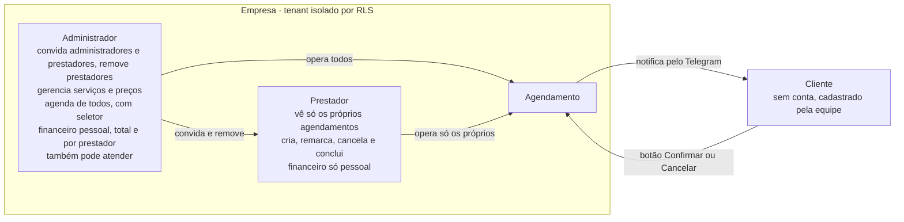
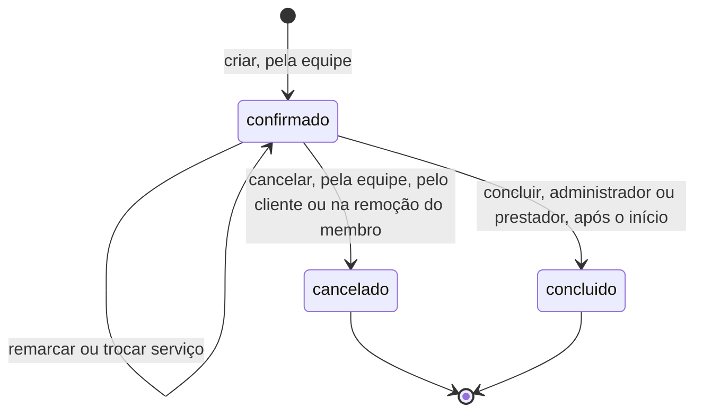
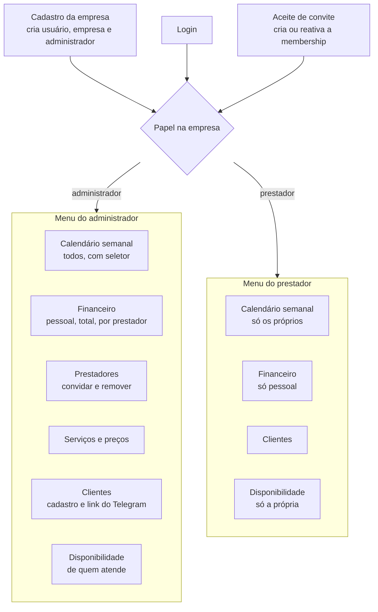
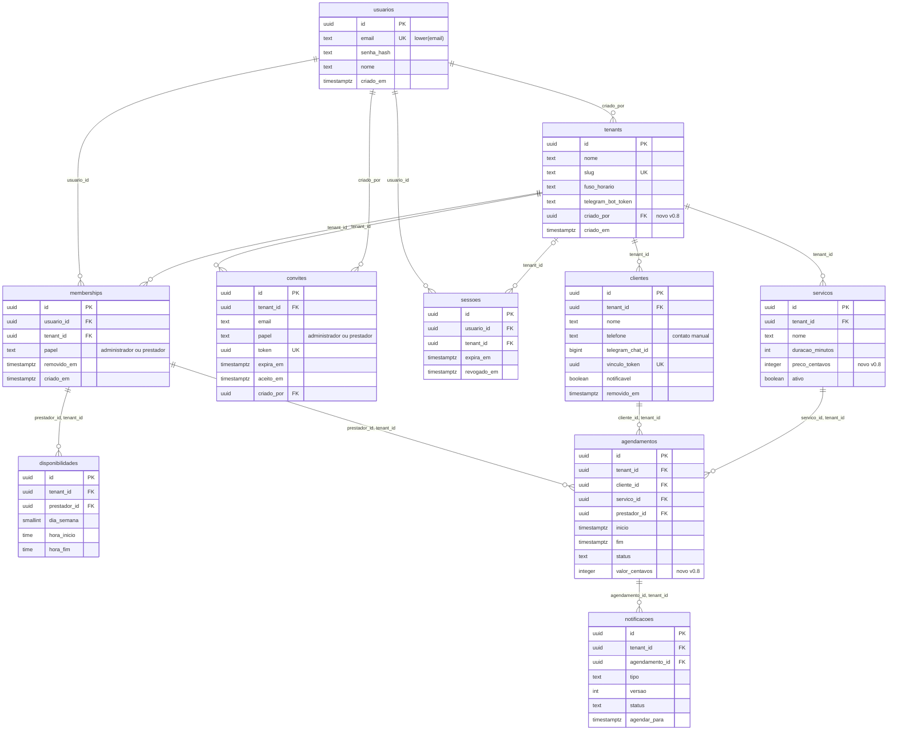

# Especificação de fluxo — Smart Booking

Versão **1.0** · 05/10/2026

Papéis, ciclo de vida do agendamento, telas e modelo de dados.

**Fontes**: repositório, `main` em `3c46550`: `docs/requisitos.md` v0.9,
`docs/guia-banco-de-dados.md` v1.5, `docs/backlog.md` v2.2, `docs/erros-api.md`.

Convenções: `RFxx`/`RNFxx` = requisitos; `n.m` = item do backlog; `§` = seção do
documento citado (req. = requisitos, guia = guia de banco). **(inferido)** marca
dedução sem texto explícito nas fontes. **Em aberto** marca lacuna; todas estão em §8.

---

## 1. Visão geral

Cada empresa (tenant) é isolada das outras pelo RLS (RF04, req. §6.2). Dentro dela há
dois papéis: **administrador**, que gerencia a empresa e também pode atender, e **prestador**, que
opera só a própria agenda (RF03, RF15). O cliente não tem conta: é cadastrado pela
equipe e recebe confirmação, lembrete e cancelamento pelo Telegram (RF08–RF10). O
agendamento nasce `confirmado` e termina `cancelado` ou `concluido`; nunca é
apagado (RF05). Só o `concluido` entra no financeiro (RF16).

---

## 2. Papéis e permissões

Papéis por tenant: `administrador` e `prestador` (RF03; `text` + `CHECK`, req. §12). O administrador
atende como qualquer prestador: `agendamentos.prestador_id` aponta para
`memberships`, não para o papel (guia §003). Papel `atendente` não existe (req. §14).

### 2.1 Matriz

Erros comuns a toda operação por id: outro tenant → 404 `nao_encontrado`; sem
sessão → 401 `nao_autenticado`.

| Ação | Administrador | Prestador | Regra / erro | Fonte |
|---|---|---|---|---|
| Criar agendamento | Sim, para qualquer membro ativo, inclusive ele | Sim, só para si | Prestador com `prestador_id` de outro → 403 `sem_permissao` (inferido do `Escopo`); membro removido não recebe agendamento (código a definir); sobreposição → 409 `conflito_horario`; valor copiado do serviço, nunca do payload | RF05, RF07, RNF11, 1.5 |
| Listar agendamentos | Todos, ou filtrados pelo seletor | Só os próprios | Prestador pedindo `prestador_id` de outro → 403 | RF15, RNF11, 1.6, 2.7 |
| Ver agendamento por id | Sim | Só os próprios | De outro prestador → 403 | req. §9 |
| Remarcar | Sim | Só os próprios | Só em `confirmado` (senão 409 `status_invalido`); 409 `conflito_horario` | RF05, 5.1 |
| Trocar serviço | Sim | Só os próprios | Só em `confirmado` e para serviço ativo; 409 `conflito_horario` | RF18, 5.1 |
| Cancelar | Sim | Só os próprios | Só em `confirmado`, a qualquer momento; senão 409 `status_invalido` | RF05, 5.1, 5.2 |
| Concluir | Sim | Só os próprios | Só em `confirmado` e com `inicio <= now()` do banco; senão 409 `status_invalido` | RF05, 5.1 |
| Excluir agendamento | Não | Não | Não existe rota; `app_user` sem `DELETE` (42501) | req. §7, guia §009 |
| Ver serviços ativos | Sim | Sim (inferido: precisa para agendar) | — | 6.1 |
| Criar, editar, desativar serviço e preço | Sim | Não | Rota só de administrador → 403 | req. §9, 6.1 |
| Disponibilidade | De qualquer membro, pelo seletor | Só a própria | Outro prestador → 403 (inferido do `Escopo`) | RF06, req. §12, 6.2 |
| Horários livres (slots) | Qualquer membro ativo | Só os próprios | `Escopo`; outro → 403 | 6.3 |
| Clientes (listar, criar, link do Telegram) | Sim | Sim | Clientes são da empresa, não do prestador | req. §3, 1.4, 3.8 |
| Convidar (administrador ou prestador) e listar convites | Sim | Não | 403 ao prestador; 409 `convite_invalido` | RF12, 2.18 |
| Aceitar convite | — | — | Quem tem sessão com o e-mail do convite | 2.19, guia §011 |
| Remover membro | Criador: qualquer um menos ele mesmo. Outro administrador: só prestadores | Não | Remover o criador → 403; administrador não criador removendo administrador → 403 | RF12, 5.8 |
| Financeiro pessoal | Sim (inferido: seletor com o próprio id) | Sim | Só `concluido` | RF16, 7.3 |
| Financeiro total e por prestador | Sim | Não | Prestador pedindo de outro → 403 | RF16, 7.3, 7.4 |
| Exportar `.ics` | Escopo do calendário | Só os próprios | Mesmo `Escopo` da listagem | RF17, 7.6 |
| Log de mensagens e reenvio | Escopo do seletor | Só os próprios | Mesmo `Escopo` | RF11, RF13, 6.8 |
| Fuso da empresa e antecedência do lembrete | A definir | A definir | Nenhuma fonte diz quem edita (Em aberto §8.8) | RNF01, 4.6, 6.4 |

### 2.2 Escopo

O RLS separa empresas; dentro da empresa, o prestador é separado por filtro na query,
sem policy extra (req. §6.2, guia §Acesso a dados).

- **`Escopo{TenantID, PrestadorID *uuid.UUID}`** é montado só pelo middleware da 2.7,
  a partir da sessão. Prestador: sempre o da sessão. Administrador: o do seletor (query
  string) ou `nil` (empresa toda). O handler nunca monta o filtro (RNF11).
- **Listagens, financeiro, `.ics`, slots e log:** filtro na query com
  `sqlc.narg('prestador_id')`. Um `nil` por bug devolve a empresa toda, sem o RLS como
  rede; daí o `Escopo` pronto.
- **Operações por id** (GET, PATCH, cancelar, concluir): `SELECT ... FOR UPDATE` no
  tenant, sem filtro de prestador; em Go, nesta ordem: sem linha → 404; `prestador_id`
  ≠ sessão e papel ≠ administrador → 403; transição ou horário inválido → 409
  `status_invalido`; então o `UPDATE`, na mesma transação.
- **`tenant_id`** sai só da sessão, nunca do corpo nem da query (RNF05). A sessão é
  revalidada contra `memberships` com `removido_em IS NULL` a cada requisição: remover
  corta o acesso na hora (req. §9).
- **Membership ativo** é exigido para criar agendamento, criar disponibilidade e
  calcular slots. O seletor do administrador e o financeiro por prestador **incluem**
  removidos, marcados "(removido)" (guia §003).
- **Testes:** 2.13 (entre tenants) e 2.16 (entre prestadores, listagem: 403 e 404);
  a 5.1 repete o critério para PATCH, cancelar e concluir. Esconder na tela não é
  autorização (RNF11).

---

## 3. Ciclo de vida do agendamento

Três status, `CHECK (status IN ('confirmado','cancelado','concluido'))`, default
`confirmado` (guia §007). Sem estado pendente, sem exclusão. `cancelado` e
`concluido` são finais (RF05).

### 3.1 Transições

| De → para | Quem | Guarda | Efeitos | Inválida |
|---|---|---|---|---|
| — → `confirmado` (criar) | Administrador (qualquer membro ativo) ou prestador (si) | Prestador com membership ativo; serviço ativo (inferido); sem sobreposição | `valor_centavos` = `preco_centavos` do serviço; `fim = inicio + duracao_minutos`; na mesma transação, outbox `confirmacao` (imediata) e `lembrete` (`agendar_para = inicio − antecedência`) | 409 `conflito_horario` (23P01); 400 `requisicao_invalida` |
| `confirmado` → `confirmado` (remarcar) | Administrador ou dono do agendamento | Status `confirmado` | `fim = novo inicio + (fim − inicio)`; valor mantido; lembrete antigo → `descartado`, novo com `versao + 1` (5.3); nenhum aviso ao cliente (Em aberto §8.7) | 409 `status_invalido`; 409 `conflito_horario` |
| `confirmado` → `confirmado` (trocar serviço) | Administrador ou dono do agendamento | Status `confirmado`; serviço novo ativo | `fim = inicio + duracao_minutos` do novo; valor recopiado; constraint de sobreposição roda de novo; lembrete não muda (inferido: `inicio` igual) | 409 `status_invalido`; 409 `conflito_horario`; serviço inativo (código a definir) |
| `confirmado` → `cancelado` (equipe) | Administrador ou dono do agendamento | Status `confirmado`, a qualquer momento | Mesma transação: `lembrete` e `confirmacao` pendentes → `descartado`; outbox `cancelamento` imediato; horário liberado (`WHERE status <> 'cancelado'` na constraint) | 409 `status_invalido` |
| `confirmado` → `cancelado` (cliente) | Cliente, botão Cancelar no Telegram | Update autenticado por `secret_token` (RNF10) | Mesmo caso de uso da 5.2; mensagem editada (5.7) | Resposta com agendamento já final: Em aberto §8.12 |
| `confirmado` → `cancelado` (remoção) | Quem remove o membro (5.8) | `inicio > now()` | Cada agendamento futuro do removido pela 5.2, na transação que grava `removido_em` | — |
| `confirmado` → `concluido` | Administrador ou dono do agendamento | `inicio <= now()` do banco, dentro do lock | Passa a contar no financeiro; nenhuma notificação | 409 `status_invalido` (zero linhas no `UPDATE`) |

Botão **Confirmar** do Telegram não é transição: só registra a presença e edita a
mensagem (req. §8.6, 5.7). Onde gravar: Em aberto §8.3.

### 3.2 Remarcar e trocar serviço

- Uma rota: `PATCH /api/agendamentos/{id}` (5.1). Trava a linha antes de decidir.
- Remarcar mantém duração e valor: o agendamento guarda o horário e o preço da época,
  mesmo que o serviço mude depois (RF18, guia §005).
- Trocar serviço só para serviço ativo; recalcula `fim`, recopia valor e pode bater
  em outro agendamento → 409 `conflito_horario`.
- A constraint vale por prestador, inclusive o administrador que atende. Consecutivos
  (9h–10h e 10h–11h) são permitidos (`'[)'`). O mesmo cliente com dois prestadores no
  mesmo horário é permitido (guia §007; uma segunda constraint exigiria decisão).
- `atualizado_em` é tocado pelo trigger `trg_agendamentos_atualizado_em`; o `.ics`
  usa como `SEQUENCE`.

### 3.3 Remoção de membro em lote (5.8)

Vale para qualquer membership, inclusive administrador que atende. Numa transação:

1. Grava `memberships.removido_em`.
2. Para cada agendamento `confirmado` do removido com `inicio > now()`: caso de uso da
   5.2 (descarta lembrete e confirmação pendentes, enfileira `cancelamento`).
3. Agendamentos passados ainda `confirmado` ficam; o administrador os conclui pela agenda.
4. Disponibilidades do removido ficam no banco, mas saem dos slots.

Reconvite reativa o membership (`ON CONFLICT ... DO UPDATE SET removido_em = NULL,
papel = EXCLUDED.papel`, guia §011).

---

## 4. Telas

Layout autenticado mostra a empresa ativa (2.11); o menu sai do papel devolvido por
`GET /api/me` (2.9, inferido). Todas as rotas da API ficam sob `/api` (req. §12);
erros no formato de `docs/erros-api.md`, lidos pelo cliente HTTP da 1.9.

### 4.1 Cadastro da empresa

- **Objetivo:** criar a conta e a empresa; quem cadastra vira administrador e criador (RF02).
- **Quem:** visitante sem sessão.
- **Campos:** nome, e-mail, senha do usuário; nome e slug da empresa (inferido das
  colunas `NOT NULL` de `usuarios` e `tenants`). Fuso começa em `America/Sao_Paulo`.
- **Regras:** e-mail normalizado (trim + minúsculas, 2.15) e único por `lower(email)`;
  senha Argon2id (2.1, RNF04); slug `^[a-z0-9][a-z0-9-]{1,48}[a-z0-9]$` e único. Uma
  transação: `usuarios` → `tenants` (com `criado_por`) → `memberships` administrador (2.2).
- **Erros:** 400 `requisicao_invalida`; e-mail ou slug já usado: código a definir
  (§8.9).
- **Backlog:** 2.2, 2.10, 2.15. Rota `POST /api/signup`.

### 4.2 Login

- **Objetivo:** abrir sessão; o papel define o menu.
- **Quem:** usuário com conta.
- **Regras:** e-mail normalizado; rate limit (RNF06, 2.8); cookie `HttpOnly` +
  `Secure` + `SameSite=Lax`, sessão na tabela `sessoes` (req. §9); `tenant_id` fica na
  sessão. Só membership ativo entra. Logout revoga (`revogado_em`, 2.4).
- **Em aberto:** como a empresa é escolhida quando o usuário tem mais de uma
  membership, e o papel do slug no login (§8.2); códigos de credencial inválida e de
  rate limit (§8.9).
- **Backlog:** 2.3, 2.4, 2.8, 2.9, 2.10. Rotas `POST /api/login`, `POST /api/logout`,
  `GET /api/me`.

### 4.3 Aceite de convite

- **Objetivo:** entrar numa empresa como administrador ou prestador (RF12).
- **Quem:** usuário com sessão cujo e-mail é o do convite (guia §011).
- **Dados:** empresa e papel do convite (inferido).
- **Regras:** token único, validade de 7 dias, uso único (`aceito_em`). Aceite cria a
  membership ou reativa a removida. Lookup por token sem tenant (`convites` fora do RLS).
- **Erros:** token inexistente → 404 `nao_encontrado`; expirado, já aceito ou e-mail já
  com membership ativo → 409 `convite_invalido`.
- **Em aberto:** convidado sem conta. O aceite exige sessão, e o único cadastro
  existente (`/signup`) sempre cria uma empresa nova (§8.1). Como o link chega ao
  convidado também não está definido.
- **Backlog:** 2.17, 2.19. Rota a definir.

### 4.4 Calendário semanal

- **Objetivo:** ver e operar a agenda da semana (RF14).
- **Quem:** administrador (todos, com seletor) e prestador (só os próprios).
- **Dados:** eixo de horas por dia da semana; cada agendamento com cliente, serviço,
  horário e status; cor por status (paleta a definir, §8.6). Horários exibidos no fuso
  do tenant (RNF01).
- **Navegação:** semana anterior e seguinte. A semana conta pelo `inicio`, no fuso do
  tenant: limites calculados em Go (`time.LoadLocation`) e enviados como
  `timestamptz` (`inicio >= de AND inicio < ate`).
- **Seletor (administrador, 7.2):** lista membros, inclusive removidos marcados "(removido)".
  O calendário abre na própria agenda; a API sem `prestador_id` devolve a empresa
  toda (§8.5).
- **Ações:** novo agendamento (cliente, serviço, prestador para o administrador, data e hora;
  slots livres a partir da 6.6); por agendamento: remarcar, trocar serviço, cancelar,
  concluir (5.4); exportar `.ics` do período (7.7). Concluir só aparece com o início
  passado (inferido da guarda).
- **`.ics` (7.6):** download, não feed; mesmo `Escopo` e período; só `confirmado` e
  `concluido`; `METHOD:PUBLISH`, `UID:<id>@smartbooking`, `DTSTAMP` = agora,
  `SEQUENCE` = epoch de `atualizado_em`, `DTSTART`/`DTEND` em UTC; cookie da sessão,
  sem token na URL.
- **Estados:** semana vazia; cliente não vinculado ou que bloqueou o bot sinalizado
  (3.9: "nunca vinculou" ≠ "bloqueou"); 409 `conflito_horario` ao salvar; 409
  `status_invalido` em ação fora de hora; 403 se o prestador forçar outro id.
- **Antes da T7:** a 1.10 (#57) é lista simples, consumindo a 1.6. A 7.1 a substitui.
  Na T1 não há sessão: tenant e prestador vêm de `TENANT_FIXO` e `PRESTADOR_FIXO`
  (1.1), removidos na 2.12 (§8.4).
- **Corte:** se faltar tempo na T7, `.ics` → financeiro por prestador → calendário
  (fica a lista da 1.10).
- **Backlog:** 1.6, 1.10, 1.11, 5.4, 6.3, 6.6, 7.1, 7.2, 7.6, 7.7. Rotas
  `GET/POST /api/agendamentos`, `PATCH /api/agendamentos/{id}`,
  `POST /api/agendamentos/{id}/cancelar`, `POST /api/agendamentos/{id}/concluir`,
  `GET /api/horarios-livres`; rota do `.ics` a definir.

### 4.5 Financeiro

- **Objetivo:** resumo mensal do que foi atendido (RF16).
- **Quem:** administrador (pessoal, total da empresa, por prestador) e prestador (só pessoal).
- **Dados:** soma de `valor_centavos` dos `concluido` no mês; para o administrador, também por
  prestador, com removidos marcados (7.4). Quantidade de atendimentos: a definir.
- **Regras:** mês pelo `inicio`, no fuso do tenant, limites calculados em Go. Soma com
  `COALESCE(sum(valor_centavos), 0)::bigint`. Valores em centavos na API, formatados em
  BRL só no frontend (R$ 45,90 = `4590`, guia §Dinheiro). `cancelado` e `confirmado`
  não contam.
- **Navegação:** mês anterior e seguinte (inferido).
- **Estados:** mês sem concluídos mostra R$ 0,00 (inferido); 403 se o prestador pedir
  outro.
- **Depende de:** 5.4 (concluir) e 6.1 (preço); sem eles o resumo sai zerado.
- **Backlog:** 7.3, 7.4, 7.5. Rota `GET /api/financeiro`.

### 4.6 Prestadores (só administrador)

- **Objetivo:** gerir quem é da empresa (RF12).
- **Dados:** membros com nome, e-mail, papel e situação (ativo ou removido); convites
  pendentes (inferido de `GET /convites`). O criador aparece sem botão de remover.
- **Ações:** convidar por e-mail com papel `administrador` ou `prestador`; remover membro (5.8).
- **Regras:** só o criador remove administrador; ninguém remove o criador; administrador não criador
  remove só prestadores. Remover cancela os futuros do removido e avisa os clientes,
  na mesma transação (§3.3). A tela deve avisar isso antes de confirmar (inferido).
- **Erros:** 403 `sem_permissao` (prestador na rota; remoção proibida); 409
  `convite_invalido` (e-mail já ativo).
- **Backlog:** 2.18, 2.20, 5.8. Rotas `POST/GET /api/convites`; remoção a definir.

### 4.7 Serviços e preços (só administrador)

- **Objetivo:** cadastrar o que a empresa vende, com duração e preço.
- **Dados:** nome, duração em minutos, preço em reais, ativo.
- **Regras:** um preço por serviço, igual para todos os prestadores (inferido: não há
  preço por prestador no modelo). `duracao_minutos` entre 1 e 1440; `preco_centavos`
  obrigatório e `>= 0`, sem default. Desativar em vez de apagar (`ativo = false`); a
  listagem filtra ativos. Mudar o preço não altera agendamentos existentes.
- **Erros:** 400 `requisicao_invalida`; 403 para o prestador.
- **Backlog:** 6.1, 6.5a (protegidos no corte). Antes da 6.6, `SERVICO_FIXO` no
  config. Rotas a definir.

### 4.8 Clientes

- **Objetivo:** cadastrar clientes e vinculá-los ao Telegram.
- **Quem:** administrador e prestador; clientes são da empresa.
- **Dados:** nome, telefone (contato manual, nunca canal), situação do Telegram:
  não vinculado, vinculado, bloqueou o bot (`notificavel = false`).
- **Ações:** listar, criar, copiar o link `https://t.me/<bot>?start=<vinculo_token>`.
- **Regras:** o token é credencial de uso único, válido por 30 dias; `/start` com token
  inválido, expirado ou já usado é recusado (3.7). Telefone sem validação E.164.
- **Em aberto:** editar, remover (`removido_em`) e regenerar o token não têm item
  (§8.10).
- **Backlog:** 1.4, 3.5, 3.8, 3.9. Rotas a definir.

### 4.9 Disponibilidade

- **Objetivo:** horários semanais de atendimento, base dos slots (RF06).
- **Quem:** administrador (de qualquer membro, pelo seletor) e prestador (só a própria).
- **Dados:** por dia da semana (0 = domingo), faixas `hora_inicio`–`hora_fim`, no fuso
  do tenant.
- **Regras:** `hora_fim > hora_inicio`; só para membership ativo; FK composta impede
  prestador de outra empresa. Slots (6.3) só de membros ativos.
- **Corte:** 6.5b é cortável (disponibilidades no seed).
- **Backlog:** 6.2, 6.3, 6.5b. Rotas a definir.

---

## 5. Modelo de dados

Toda tabela de negócio tem `tenant_id`. `usuarios` não tem: o vínculo mora em
`memberships`. As FKs de `agendamentos` e `disponibilidades` são compostas com
`tenant_id` e apontam para `memberships (usuario_id, tenant_id)`, não para `usuarios`.
`sessoes` e `notificacoes` entram aqui por completude.

### 5.1 Tabelas

Só o que o guia v1.5 define. Ordem das migrations: 001 extensões → 002 tenants → 003
usuarios, memberships, `tenants.criado_por` → 004 clientes → 005 servicos → 006
disponibilidades → 007 agendamentos → 008 notificacoes → 009 RLS + `REVOKE` → 010
sessoes → 011 convites.

**tenants** (002, `criado_por` na 003)

| Coluna | Tipo e regra |
|---|---|
| `id` | `uuid` PK, `gen_random_uuid()` |
| `nome` | `text NOT NULL` |
| `slug` | `text NOT NULL UNIQUE`, `CHECK slug_formato` |
| `fuso_horario` | `text NOT NULL DEFAULT 'America/Sao_Paulo'`, validado na aplicação contra `pg_timezone_names` |
| `telegram_bot_token` | `text` nulo (bot da plataforma); não preencher enquanto `tenants` estiver fora do RLS |
| `criado_por` | `uuid NOT NULL → usuarios ON DELETE RESTRICT`, gravado pelo signup |
| `criado_em` | `timestamptz NOT NULL DEFAULT now()` |
| antecedência do lembrete | a definir (4.6 a torna configurável por tenant; coluna não especificada) |

**usuarios** (003): `id`, `email text NOT NULL` com índice único `lower(email)`,
`senha_hash`, `nome`, `criado_em`. Sem `tenant_id`.

**memberships** (003)

| Coluna | Tipo e regra |
|---|---|
| `usuario_id` | `→ usuarios ON DELETE CASCADE` |
| `tenant_id` | `→ tenants ON DELETE CASCADE` |
| `papel` | `text NOT NULL`, `CHECK (papel IN ('administrador','prestador'))` |
| `removido_em` | `timestamptz` nulo; exclusão lógica |
| — | `UNIQUE (usuario_id, tenant_id)`: impede duplicado e é alvo das FKs compostas |

**convites** (011): `tenant_id → tenants CASCADE`, `email`, `papel` com
`CHECK ('administrador','prestador')`, `token uuid UNIQUE`, `expira_em DEFAULT now() + 7 days`,
`aceito_em` nulo, `criado_por → usuarios RESTRICT`, `criado_em`.

**sessoes** (010): `usuario_id → usuarios CASCADE`, `tenant_id` nulo `→ tenants
CASCADE`, `criado_em`, `expira_em` (`CHECK expira_em > criado_em`), `revogado_em`,
`user_agent`.

**clientes** (004)

| Coluna | Tipo e regra |
|---|---|
| `nome` | `text NOT NULL` |
| `telefone` | `text` nulo, contato manual; nenhuma query do worker o referencia |
| `telegram_chat_id` | `bigint` nulo; `UNIQUE (tenant_id, telegram_chat_id)` sem `NULLS NOT DISTINCT` |
| `vinculo_token` | `uuid UNIQUE DEFAULT gen_random_uuid()`, único global |
| `vinculo_expira_em` | `NOT NULL DEFAULT now() + 30 days` |
| `vinculado_em` | nulo; `CHECK vinculo_coerente` com `telegram_chat_id` |
| `notificavel` | `boolean NOT NULL DEFAULT true`; `false` quando o Telegram responde 403 |
| `removido_em` | exclusão lógica |
| — | `UNIQUE (id, tenant_id)` |

**servicos** (005): `nome`, `duracao_minutos int NOT NULL CHECK (> 0 AND <= 1440)`,
`preco_centavos integer NOT NULL CHECK (>= 0)` sem default, `ativo boolean DEFAULT
true`, `criado_em`, `UNIQUE (id, tenant_id)`.

**disponibilidades** (006): `prestador_id`, `dia_semana smallint CHECK 0–6`,
`hora_inicio time`, `hora_fim time` com `CHECK hora_fim > hora_inicio`; FK
`(prestador_id, tenant_id) → memberships (usuario_id, tenant_id) ON DELETE CASCADE`.

**agendamentos** (007)

| Coluna | Tipo e regra |
|---|---|
| `cliente_id`, `servico_id`, `prestador_id` | FKs compostas com `tenant_id`, `ON DELETE RESTRICT`; prestador → `memberships` |
| `inicio`, `fim` | `timestamptz NOT NULL`, `CHECK fim > inicio`; `fim` gravado, não derivado |
| `status` | `text NOT NULL DEFAULT 'confirmado'`, `CHECK` com os três status |
| `valor_centavos` | `integer NOT NULL CHECK (>= 0)`, copiado do serviço |
| `observacoes` | `text` nulo |
| `criado_em`, `atualizado_em` | `atualizado_em` pelo trigger `app.tocar_atualizado_em` |
| — | `UNIQUE (id, tenant_id)`; `EXCLUDE sem_sobreposicao (tenant_id =, prestador_id =, tstzrange(inicio, fim, '[)') &&) WHERE status <> 'cancelado'` |
| confirmação de presença | a definir (§8.3) |

**notificacoes** (008): `tipo CHECK ('confirmacao','lembrete','cancelamento')`,
`versao int DEFAULT 1`, `status CHECK ('pendente','enviado','falhou','descartado')`,
`agendar_para` (nulo = imediato), `tentativas`, `proxima_tentativa`, `enviado_em`,
`telegram_message_id`, `erro`; `UNIQUE (agendamento_id, tipo, versao)`; FK composta
para `agendamentos` com `ON DELETE CASCADE`.

### 5.2 Índices

| Índice | Uso |
|---|---|
| `usuarios_email_unico` em `lower(email)` | Login e signup |
| `idx_memberships_usuario`, `idx_memberships_tenant` | Sessão e lista de membros |
| `idx_clientes_tenant`, `idx_servicos_tenant` | Listagens |
| `idx_disponibilidades_prestador (tenant_id, prestador_id, dia_semana)` | Slots |
| `idx_agendamentos_tenant_inicio (tenant_id, inicio)` | Agenda da empresa |
| `idx_agendamentos_cliente (tenant_id, cliente_id)` | FK do cliente |
| `idx_agendamentos_prestador_inicio (tenant_id, prestador_id, inicio)` | Escopo por prestador, calendário, financeiro; cobre a FK |
| `idx_notificacoes_fila (agendar_para NULLS FIRST) WHERE status = 'pendente'` | Fila do worker |
| `idx_notificacoes_agendamento (agendamento_id, tenant_id)` | Descarte no cancelamento |
| `idx_sessoes_usuario`; `idx_sessoes_validas (expira_em) WHERE revogado_em IS NULL` | Sessão |
| `idx_convites_tenant` | Listar convites |

### 5.3 RLS e privilégios

- **Com RLS** (`ENABLE` + `FORCE`, policy `isolamento_tenant` com `USING` e
  `WITH CHECK` sobre `app.current_tenant_id()`): `clientes`, `servicos`,
  `disponibilidades`, `agendamentos`, `notificacoes` (009).
- **Fora do RLS**, `WHERE` manual obrigatório: `usuarios`, `memberships`, `tenants`,
  `sessoes`, `convites`. São lidas antes de existir contexto de tenant.
- Tenant por transação: `set_config('app.tenant_id', $1, true)` via `ComTenant`,
  nunca `SET`. Sem tenant definido, a função devolve `NULL` e nenhuma linha volta.
- O RLS não separa prestadores; isso é o `Escopo` (§2.2).
- `app_user`: não é dono, sem `BYPASSRLS`. `REVOKE DELETE ON agendamentos FROM
  app_user` na 009 (Down devolve o `GRANT`); `DELETE` como `app_user` falha com
  `42501`.
- Exclusão lógica: `servicos.ativo`, `clientes.removido_em`, `memberships.removido_em`.

---

## 6. Erros da API

Corpo `{"erro": {"codigo", "mensagem", "detalhes"}}`; o frontend decide pelo `codigo`.
Os marcados "previsto" ainda não estão em `internal/api/erros.go` e entram no PR do
card indicado.

| HTTP | `codigo` | Quando | Card |
|---|---|---|---|
| 400 | `requisicao_invalida` | JSON malformado, campo obrigatório ausente, valor inválido | 1.7 |
| 401 | `nao_autenticado` | Cookie ausente, expirado ou revogado (previsto) | 2.5 |
| 403 | `sem_permissao` | Agendamento de outro prestador; `prestador_id` de outro pedido por prestador; rota só de administrador; remover o criador; administrador não criador removendo administrador (previsto) | 2.7, 5.8 |
| 404 | `nao_encontrado` | Recurso inexistente ou de outro tenant; token de convite inexistente | 1.7 |
| 409 | `conflito_horario` | Sobreposição (23P01) no `POST` e no `PATCH` | 1.5, 5.1 |
| 409 | `status_invalido` | Concluir antes do início; cancelar, remarcar ou trocar serviço de `cancelado` ou `concluido` (previsto) | 5.1 |
| 409 | `convite_invalido` | Convite expirado, já aceito ou para e-mail com membership ativo (previsto) | 2.18, 2.19 |
| 500 | `erro_interno` | Falha inesperada; mensagem genérica, detalhe só no log | 1.7 |

Fora do formato da API: o webhook do Telegram responde 401 quando o
`X-Telegram-Bot-Api-Secret-Token` não bate (RNF10, 3.15).

---

## 7. Fora do escopo

| Tema | Motivo | Fonte |
|---|---|---|
| Transferir a empresa ou recuperá-la se o criador sair ou perder a conta | Criador não é removível; trocar de dono pede fluxo próprio | req. §14 |
| Feed (assinatura) `.ics` | Exigiria URL com token e exporia a agenda fora da sessão | req. §14, RF17 |
| Papel `atendente` | Removido na v0.8 | req. §14 |
| Excluir agendamento | Termina `cancelado` ou `concluido` | RF05, req. §12 |
| Estado pendente / aprovação do agendamento | Nasce `confirmado` | RF05 |
| Conta e login do cliente | Cliente só interage pelo Telegram | README |
| Telefone como canal de notificação | Contato manual | req. §12 |
| Bot por empresa | Bot único no MVP; coluna já prevista | req. §8.3 |
| Preço por prestador | Um preço por serviço (inferido do modelo) | guia §005 |

---

## 8. Pontos em aberto

1. **Convidado sem conta.** O aceite exige sessão com o e-mail do convite, mas o único
   cadastro (`/signup`) cria empresa nova. Como o link chega ao convidado também não
   está definido. *Recomendação:* na 2.19, a tela de aceite oferece "criar conta" que
   grava só `usuarios` + membership do convite, com e-mail fixo no do convite; o administrador
   copia o link na tela de prestadores (sem envio de e-mail no MVP).
2. **Empresa no login.** O modelo admite várias memberships (req. §6.3), `sessoes.tenant_id`
   é nulo, e req. §6.2 fala em resolver o slug no login; nada diz como o usuário
   escolhe a empresa. *Recomendação:* com uma membership ativa, entra direto; com
   várias, tela de escolha após o login; decidir na 2.3/2.9.
3. **Onde gravar o Confirmar do Telegram.** "Registra a confirmação de presença" sem
   coluna no modelo. *Recomendação:* coluna nula `presenca_confirmada_em timestamptz`
   em `agendamentos`, por migration nova na 5.6, e indicador no calendário; decidir
   antes da 5.5.
4. **#57 (1.10) com `PRESTADOR_FIXO`.** Na T1 não há sessão; a 1.6 aceita
   `prestador_id` opcional sem regra, e não está dito se a lista filtra pelo prestador
   fixo. *Recomendação:* a lista não filtra (usa só `TENANT_FIXO`); `PRESTADOR_FIXO`
   vale só no `POST` (1.5). Registrar no corpo do #57.
5. **Visão inicial do administrador.** O calendário abre na própria agenda; a API
   sem `prestador_id` devolve a empresa toda, e um administrador que não atende veria a
   semana vazia. *Recomendação:* abrir na própria se o administrador tem agendamentos ou
   disponibilidade, senão em "Todos"; o seletor sempre tem "Todos". Registrar na 7.2.
6. **Cores por status e cancelados no calendário.** RF14 pede cor por status, sem
   paleta, e não diz se cancelados aparecem. *Recomendação:* três cores fixas; cancelado
   esmaecido e oculto por padrão, com filtro para mostrar.
7. **Aviso ao cliente na remarcação.** Remarcar descarta o lembrete e cria outro
   (5.3), mas nenhum tipo de notificação avisa o novo horário; trocar serviço muda o
   `fim` sem aviso. *Recomendação:* na 5.3, enfileirar `confirmacao` com `versao + 1`
   (a `UNIQUE (agendamento_id, tipo, versao)` já permite), com texto de remarcação (3.14).
8. **Configuração da empresa.** Fuso (6.4) e antecedência do lembrete (4.6) são por
   tenant, sem tela, sem papel definido e, para a antecedência, sem coluna.
   *Recomendação:* tela "Empresa" só do administrador; coluna da antecedência definida no card
   4.6.
9. **Códigos de erro não definidos.** Credencial inválida e rate limit no login;
   e-mail ou slug já usados no signup; serviço inativo na troca; prestador removido ou
   cliente removido ao criar agendamento. *Recomendação:* acrescentar em "Códigos
   previstos" do `erros-api.md` nos cards 2.2, 2.3, 2.8 e 5.1 (ex.: 401 para
   credencial, 429 para rate limit, 409 para duplicado, 400 para referência inativa).
10. **Clientes além de listar e criar.** Editar, remover (`removido_em`) e regenerar o
    `vinculo_token` (expira em 30 dias) não têm item no backlog. *Recomendação:* card
    pequeno na T3 junto da 3.8, ou registrar como corte consciente.
11. **Log de mensagens e reenvio sem tela.** 6.8 e RF13 existem no backlog, mas não
    têm tela. *Recomendação:* exibir no detalhe do agendamento, no calendário.
12. **Botão Cancelar com agendamento já final ou começado.** O callback (5.6) não tem
    resposta definida para `cancelado`/`concluido`. *Recomendação:* não mudar nada,
    responder com o status atual e editar a mensagem (5.7), sem retornar erro ao
    Telegram.
